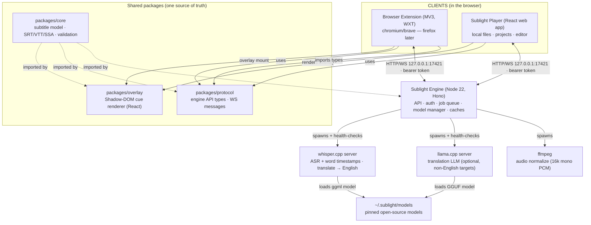

# Component diagram

> Partners in crime: [Deployment diagram](Deployment.md) (processes/ports) and [Data flow](Data-Flow.md) (sequence). Formal component contracts: [Spec 01](../../specification/01-System-Overview.md).

## Responsibilities in one line each

| Component       | Responsibility                                                                                                              | Detailed spec                                               |
| --------------- | --------------------------------------------------------------------------------------------------------------------------- | ----------------------------------------------------------- |
| **Extension**   | Discover video in any page, mount overlay, capture tab audio, bridge to engine via service worker, popup/options UI.        | [Spec 09](../../specification/09-Browser-Extension.md)      |
| **Player**      | Play local files (File System Access API), manage projects/tracks, orchestrate captioning jobs, edit cues, export SRT.      | [Spec 04](../../specification/04-Player-App.md)             |
| **overlay**     | Render cues (styled, synced, bilingual/karaoke modes) inside a Shadow DOM host; measure the play region.                    | [Spec 05](../../specification/05-Overlay-Rendering.md)      |
| **core**        | Pure model: `SubtitleProject`, `SubtitleTrack`, `SubtitleCue`, words; SRT/VTT parsing & writing; validation.                | [Spec 02](../../specification/02-Data-Model.md)             |
| **protocol**    | Typed HTTP + WS contract shared client/server; keeps the engine and clients honest at compile time.                         | [Spec 03](../../specification/03-Protocol.md)               |
| **Engine**      | Auth, job queue (GPU-serialized), model manager (pinned manifest), ffmpeg normalization, media/transcript cache, WS events. | [Spec 06](../../specification/06-Engine-Server.md)          |
| **whisper.cpp** | Speech → segments + word-level timestamps (16 kHz mono PCM).                                                                | [Spec 07 §1](../../specification/07-ASR-And-Translation.md) |
| **llama.cpp**   | Paragraph translation + optional language detection/glossary-aware output.                                                  | [Spec 07 §2](../../specification/07-ASR-And-Translation.md) |
| **ffmpeg**      | Any container/audio → 16 kHz mono PCM WAV for ASR; silence trimming; duration probing.                                      | [Spec 06 §4](../../specification/06-Engine-Server.md)       |

## System boundaries

- **Trust boundary A — browser ↔ engine:** all network traffic; defended by bearer token + Origin + Host checks ([ADR-0006](../../architecture/decisions/0006-engine-transport.md)).
- **Boundary B — page ↔ extension content script:** page scripts can't read the overlay shadow DOM or storage; content script is isolated from page JS.
- **Boundary C — engine ↔ model binaries:** pinned, checksummed artifacts only ([ADR-0016](../../architecture/decisions/0016-model-licensing.md)).
- **No cloud boundary exists:** the machine is also the server.

See the [threat model sketch](../../audits/Security-Baseline-Plan.md) for what attacks each boundary defends against.
