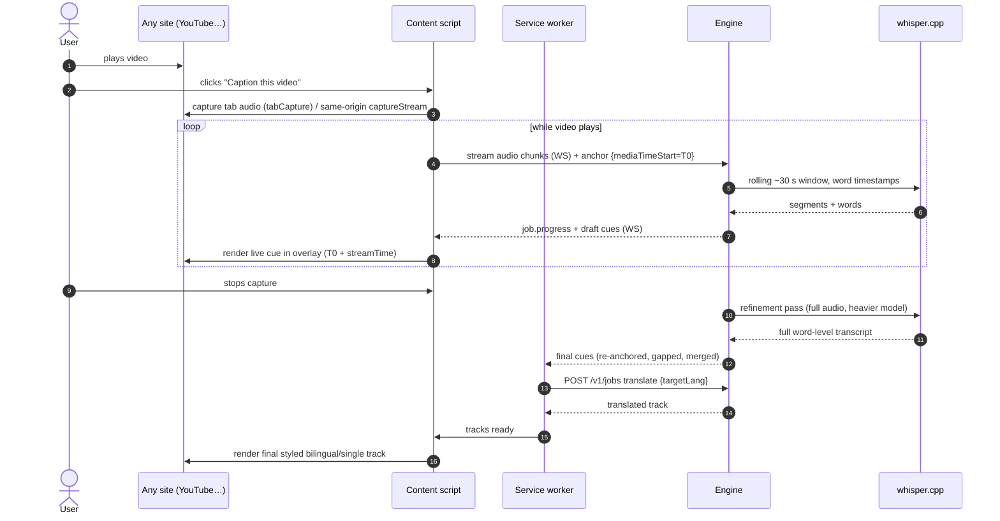
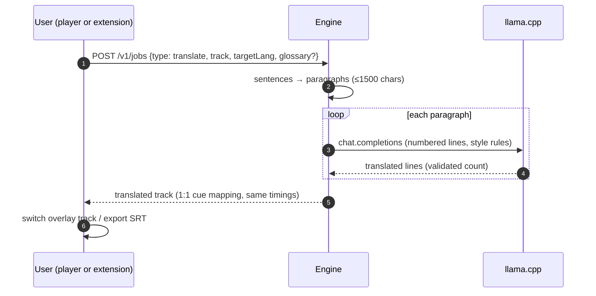

# Data flow — the three core journeys

> Two partners: [Component diagram](Components.md) (actors) and [Deployment diagram](Deployment.md) (processes/ports).

## 1. Online video — live captioning while you watch (then refinement)



## 2. Local file — batch captioning in the Player

```mermaid
sequenceDiagram
    autonumber
    actor User
    participant PL as Player app
    participant FS as File System Access API
    participant ENG as Engine
    participant FF as ffmpeg
    participant WSr as whisper.cpp
    participant LL as llama.cpp
    User->>PL: opens video file
    PL->>FS: open read stream from file handle
    PL->>ENG: PUT /v1/media (stream file), job {type: transcribe}
    ENG->>FF: extract + normalize → 16 kHz mono PCM (hash = H)
    FF-->>ENG: audio.wav
    alt cache hit on H
        ENG-->>PL: cached cues (skip ASR)
    else cache miss
        ENG->>WSr: transcribe full audio (word timestamps)
        WSr-->>ENG: segments + words
        ENG->>LL: translate paragraphs (target language)
        LL-->>ENG: translated lines
    end
    ENG-->>PL: final tracks (WS progress throughout)
    PL->>User: overlay renders; user styles, edits, exports SRT
```

## 3. Translation on existing transcript



## Anchoring math (referred to by all flows)

`videoTime(cue) = audioStreamTime(cue) + T₀ + δ`

- `T₀` = `video.currentTime` when capture began (or 0 for local files).
- `δ` = fine offset from first-speech-onset cross-check; user-adjustable ±50 ms.
- Refinement re-anchors every ~2 min of strong speech to bound drift. Full derivation in [Spec 07 §1](../../specification/07-ASR-And-Translation.md).