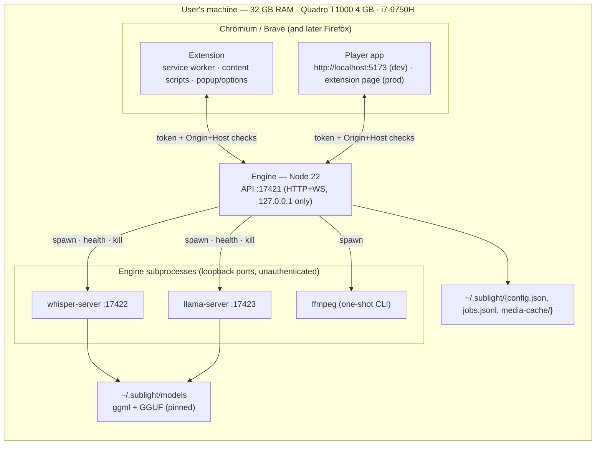

# Deployment diagram

> Process topology and ports. Component contracts: [Components](Components.md). Sequence: [Data flow](Data-Flow.md).

## Process & port notes

| Process        | Port              | Auth                                    | Notes                                                                                              |
| -------------- | ----------------- | --------------------------------------- | -------------------------------------------------------------------------------------------------- |
| Engine API     | `127.0.0.1:17421` | Bearer token (+ Origin/Host checks)     | The only publicly reachable surface to clients ([Spec 03](../../specification/03-Protocol.md)).    |
| whisper-server | `127.0.0.1:17422` | none (loopback only, spawned by engine) | Word timestamps enabled per [ADR-0007](../../architecture/decisions/0007-whisper-model-matrix.md). |
| llama-server   | `127.0.0.1:17423` | none (loopback only, spawned by engine) | OpenAI-compatible /v1/chat/completions.                                                            |
| ffmpeg         | —                 | —                                       | One-shot CLI per normalization job; never a listener.                                              |

## Lifecycle

- **Engine start:** read `config.json` (token, ports, default model ids) → spawn ffmpeg check → spawn whisper/llama lazily **on first job of that type** (VRAM swap policy in [Spec 06 §2](../../specification/06-Engine-Server.md)) → health endpoint `GET /v1/health` → clients see `"online"`.
- **Client start:** the player/extension ping health; if `offline`, show a friendly "start the engine" card with a one-click launcher (M06: autostart on login).
- **Shutdown:** engine drains the queue (mark running jobs `interrupted`, resumable), kills subprocesses, flushes `jobs.jsonl`.

## Failure isolation

- Engine crash → clients keep the last rendered state; jobs restartable (idempotency + content-hash cache).
- whisper/llama crash on a job → worker restarted, job `failed(worker_restarted, retryable=true)`.
- GPU OOM → engine detects `CUDA out of memory`, retries job half-offloaded to CPU (or suggests `base` model).
- See [Spec 10](../../specification/10-Non-Goals-And-Failure-Modes.md) for the full failure-mode matrix.
