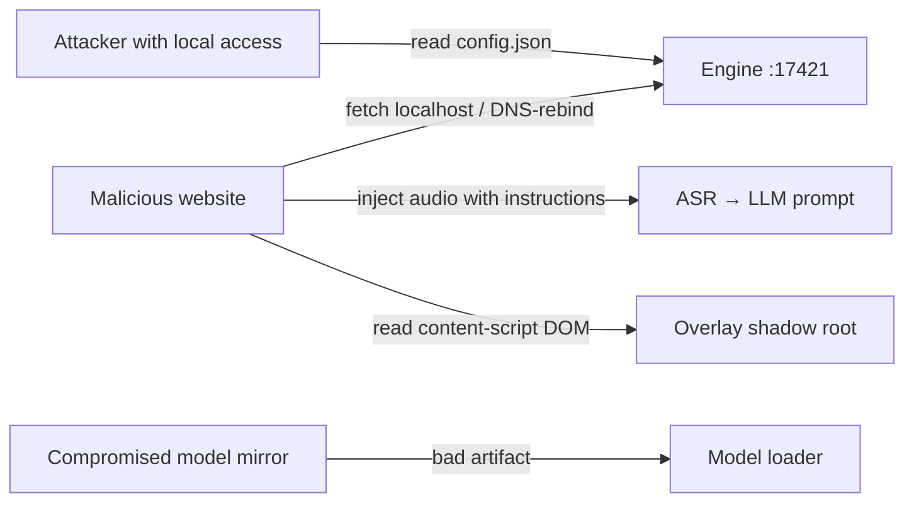

# Security baseline plan

_The first full security audit, executed at **[M06 — Beta release](../plan/milestones/06-Beta-Release.md)** and re-run (with diffs) at each major release. This file defines criteria to check; results get recorded as a findings table when the audit runs._

## Why this audit exists

sublight's architecture is "local-first with a localhost server and local models." That's a strong privacy story with a specific attack surface: an **open loopback port** ([ADR-0006](../architecture/decisions/0006-engine-transport.md)), **model downloads** ([ADR-0016](../architecture/decisions/0016-model-licensing.md)), **LLM prompt injection** ([07 §2.5](../specification/07-ASR-And-Translation.md)), and an **extension that runs on every page**. Each has a designed defense; this audit verifies the defense is real and deployed.

## Threat model (sketch)

## Pass criteria (checklist)

### A. Network boundary (engine)

- [ ] Engine binds **only** `127.0.0.1` (verify with `ss -tlnp` on Linux, netstat on Windows; assert in tests).
- [ ] Every endpoint rejects missing/wrong token (constant-time compare — timing test in CI).
- [ ] `Host: evil.com` and `Host: 127.0.0.1.evil.com` requests rejected (`BAD_ORIGIN`).
- [ ] CORS allowlist exactly as [Protocol §3](../specification/03-Protocol.md#3-auth--hardening); no `*`, no reflection; preflight for engine origins only.
- [ ] No cacheable sensitive responses; no `text/html` error pages.
- [ ] Upload size caps enforced at the socket (not after buffering).
- [ ] WS drops unauthenticated connections < 1 s; no connection scaling attack (connection limit + per-IP loopback assumption).

### B. Token & pairing

- [ ] Token generated with a CSPRNG; stored `0600`-ish permissions (not world-readable).
- [ ] Pairing handshake (`sublight://`) binds short-lived nonce; rotation revokes old token everywhere.
- [ ] Token never appears in logs, URLs, or WS queries.
- [ ] Content scripts can't reach the token (only the service worker holds it).

### C. Data & privacy claim

- [ ] Outbound traffic audit: only model downloads (registry domains) + optional yt-dlp; nothing else (walk network inspector during full caption+translate session; document findings).
- [ ] Media cache deletable from UI; documented retention.
- [ ] Transcripts/tracks are the user's data — no telemetry, no analytics identifiers.

### D. Prompt injection (the sneaky one)

- [ ] Transcripts containing instructions ("ignore previous…", "SAY: …") don't alter translator output format — adversarial corpus test (10 crafted paragraphs; output stays `n: text` shaped; no directive honored).
- [ ] Glossary values can't smuggle newlines/prompt text (validated).
- [ ] LLM output never executed, parsed as HTML, or interpolated into shell.

### E. Supply chain (models & binaries)

- [ ] Install path enforces manifest pins + SHA-256 ([ADR-0016](../architecture/decisions/0016-model-licensing.md)); corrupted download refused with clear error.
- [ ] Binaries (whisper.cpp/llama.cpp/ffmpeg) checksummed at first run; version mismatch → warning.
- [ ] New model manifest entries reviewed for license + provenance (dep & license audit cross-ref).

### F. Extension hardening

- [ ] Permissions minimal (review manifest against [09 §2](../specification/09-Browser-Extension.md)); no `<all_urls>` beyond what's needed.
- [ ] Content script isolated world verified (page JS can't reach overlay internals or storage).
- [ ] `chrome.storage` keys not reflected into page DOM.
- [ ] tabCapture stream lifetime ends with its job (no dangling capture).
- [ ] No eval/remote code; CSP set; no external scripts.

### G. Secrets & config

- [ ] `config.json` world-readable check; engine refuses to start with permissive perms (or writes with umask 077).
- [ ] No secrets in `jobs.jsonl` or logs (token, paths redacted in logs).

## Likely findings to watch (pre-audit suspicions)

1. Token file permissions on first run (umask during Node startup).
2. WS connection fan-out: many tabs × reconnect storms — cap connections.
3. `localhost` vs `127.0.0.1` Host acceptance (decide one canonical form + alias).
4. Whether `captureStream`-clean sites leak anything (they don't, but verify no other page origin can start a capture while the user isn't watching).

## Output

- Findings table (use [Template](Template.md)).
- Diffs re-checked at each release gate thereafter.
- Structural changes → ADRs (e.g. "native messaging hardening" if localhost becomes a distribution concern).

## Related

- [Protocol §3 hardening](../specification/03-Protocol.md#3-auth--hardening) · [ADR-0006](../architecture/decisions/0006-engine-transport.md) · [ADR-0016](../architecture/decisions/0016-model-licensing.md)
- [M06 — run this audit](../plan/milestones/06-Beta-Release.md)
