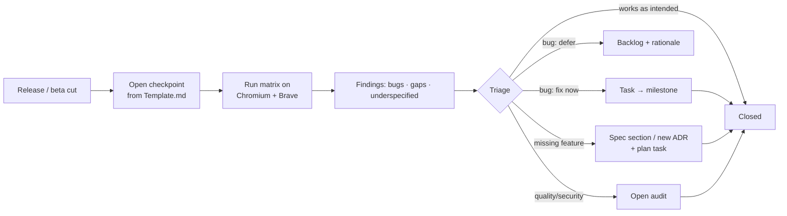

# Checkpoints

_After each release / beta release we test, find bugs, find missing features, find things we forgot or underspecified — and we record it all here, triaged, so it becomes work._

Checkpoints answer three questions honestly:

1. **Did it work?** — the release test matrix (browsers, sites, flows, performance numbers).
2. **What's broken?** — bugs, with severity and reproduction.
3. **What did we get wrong?** — missing features, forgotten requirements, underspecified specs; routed to their _owner documents_ (specification / plan / decisions / audits).

## Process

- **Open** — testing in progress · **In triage** — findings being routed · **Closed** — every finding has a disposition (fixed / scheduled / won't-fix with reason).
- A release is only "released" once its checkpoint is closed (per [Definition of done](../plan/Roadmap.md#definition-of-done-for-a-release-beta-1-and-later)).

## Index

| Checkpoint                    | Release | Status                                                                      | Opened | Summary                                                                                                                               |
| ----------------------------- | ------- | --------------------------------------------------------------------------- | ------ | ------------------------------------------------------------------------------------------------------------------------------------- |
| [Beta 1](Beta-1-Checklist.md) | Beta 1  | `open` (planned — executed at [M06](../plan/milestones/06-Beta-Release.md)) | —      | First full matrix incl. live captioning, translation, sync numbers. The template is pre-filled; fill the "actual" columns during M06. |

## Template

Copy [Template.md](Template.md) for every new checkpoint. Fill **expected** rows before testing (that forces us to think about what "good" is) and **actual** rows during.

## How findings route

| Finding                | Goes to                                                               | Example                                                               |
| ---------------------- | --------------------------------------------------------------------- | --------------------------------------------------------------------- |
| Bug (reproducible)     | New task in the owning [milestone](../plan/milestones/) with severity | "Cues overlap after 30-min capture"                                   |
| Missing feature        | New spec section or open item here, + plan task                       | "No way to delete a word list"                                        |
| Underspecified         | Spec edit + decision if structural                                    | "Spec 07 didn't define re-anchor frequency → now bounded every 2 min" |
| Forgotten requirement  | This list ("things we forgot") + requirement addendum                 | "Users want per-episode folders"                                      |
| Security/quality smell | [Audit](../audits/README.md)                                          | "Let's do a code audit before Beta 2"                                 |

## Related

- [Plan / Roadmap](../plan/Roadmap.md) · [Spec 10 — failure modes](../specification/10-Non-Goals-And-Failure-Modes.md) · [Audits](../audits/README.md)
- [Beta-1 checklist](Beta-1-Checklist.md) (the template in action)
