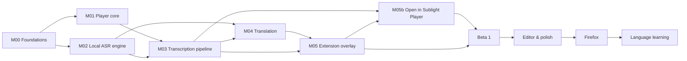

# Roadmap

_Targets are indicative, not promises. Sequencing is the load-bearing part: each milestone unlocks the next's testable slice._

## Milestone table

| M   | Milestone               | Status        | Target | Exit criteria (summary)                                                                                                                                                                                                       |
| --- | ----------------------- | ------------- | ------ | ----------------------------------------------------------------------------------------------------------------------------------------------------------------------------------------------------------------------------- |
| 00  | Foundations             | `done`        | —      | Monorepo builds & tests in CI; Playwright harness runs Chromium + Brave; sync-accuracy corpus + harness ready; docs live.                                                                                                     |
| 01  | Player core             | `done`        | M01    | Play any local file; overlay renders styled cues; SRT import/export round-trips; cues persist across sessions.                                                                                                                |
| 02  | Local ASR engine        | `done`        | M02    | Engine serves `/v1`; whisper.cpp transcribes with word timestamps and translates →English; jobs run/cancel/resume; models install from pinned manifest.                                                                       |
| 03  | Transcription pipeline  | `done`        | M03    | Local file → captions end-to-end with anchoring; median word-onset error ≤ 250 ms on the corpus; refinement pass works.                                                                                                       |
| 04  | Translation pipeline    | `not-started` | M04    | LLM path for non-English targets (English is Whisper, M02): meaning-preserving in ≥ 3 languages; glossary honored; bilingual tracks render; full-film translate job completes.                                                |
| 05  | Extension overlay       | `not-started` | M05    | Live captions on YouTube + 3 reference sites; tab capture; SPA navigation; styling UI; overlay survives page CSS.                                                                                                             |
| 05b | Open in Sublight Player | `not-started` | M05b   | Page video → player in one click: classified sources, layered transport (direct → hls/dash → engine relay), resume, offline-batch captioning of relayed media. Beta 1 target (non-blocking; falls to Beta 2 if M05/M03 slip). |
| 06  | Beta 1                  | `not-started` | M06    | Packaged, installable; pairing UX smooth; **Checkpoint Beta 1** opened & triaged.                                                                                                                                             |
| 07  | Editor & polish         | `not-started` | M07    | Cue editor, sync nudge, prefs UI, perf budgets met.                                                                                                                                                                           |
| 08  | Firefox                 | `not-started` | M08    | Firefox build passes parity matrix (incl. live captioning path).                                                                                                                                                              |
| 09  | Language learning       | `not-started` | M09    | Dual-language study mode sharing lib with the sibling tool; vocab export.                                                                                                                                                     |

## Definition of done for a release (Beta 1 and later)

From the [checkpoint template](../checkpoints/Template.md):

1. All milestone acceptance criteria for the release are checked.
2. The [test matrix](../checkpoints/Beta-1-Checklist.md) was executed on **Chromium and Brave** (and Firefox at M08+).
3. Known bugs are triaged to fix-now / fix-later / won't-fix with rationale.
4. Missing or underspecified features found during testing are recorded and routed: → new spec section, → new task, → new ADR, or → [audit](../audits/README.md).
5. The checkpoint is `closed` (or explicitly carried with owners).

## Risks and unknowns

| Risk                                                                                  | Likelihood | Impact              | Mitigation                                                                                                                                                                                |
| ------------------------------------------------------------------------------------- | ---------- | ------------------- | ----------------------------------------------------------------------------------------------------------------------------------------------------------------------------------------- |
| whisper.cpp word timestamps insufficient for "perfect" sync on noisy real-world audio | Medium     | High (core promise) | Refinement pass + fallback to whisperX-style forced alignment ([Spec 10](../specification/10-Non-Goals-And-Failure-Modes.md)); sync corpus measures it before M06.                        |
| tabCapture UX friction or capture gaps on some sites                                  | Medium     | Medium              | Same-origin capture + yt-dlp toggle; clear permission copy; site matrix in checkpoints.                                                                                                   |
| 4 GB VRAM contention (ASR ↔ LLM) slows translation                                    | Medium     | Medium              | GPU-serialized queue + model swap; NLLB low-VRAM alternative ([ADR-0009](../architecture/decisions/0009-translation-stack.md)).                                                           |
| YouTube changes internals (selectors, player)                                         | High       | Low                 | Selector-resilient discovery (find `<video>` by tag, not class); graceful degradation; checkpoint-driven fixes.                                                                           |
| Open-in-player relay (yt-dlp) weakens or breaks                                       | Medium     | Medium              | S1/S1b direct + manifest transports cover non-DRM sites with zero engine; relay is v1 buffer + v2 stream; honest error copy with alternatives ([M05b](milestones/05b-Open-in-Player.md)). |
| Local LLM translation quality on an unexpected language pair disappoints              | Medium     | Medium              | Language-pair matrix in checkpoints; glossary; NLLB fallback for rare langs.                                                                                                              |
| Engine token/localhost security regresses                                             | Low        | High                | Origin+Host+token checks are audited ([security baseline](../audits/Security-Baseline-Plan.md)) and re-tested each release.                                                               |

## How the roadmap is updated

- Committing to a milestone = its frontmatter flips to `in-progress` and tasks get owners/dates.
- Reality that delays a milestone goes to [checkpoints](../checkpoints/README.md) with a triage decision — the roadmap only moves _after_ a checkpoint says so, never before.
