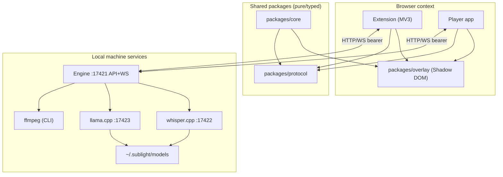

# 01 — System overview

_The map. Components, their relationships, the three runtime topologies, and the trust boundaries between them._

## 1. Component map

Actors and one-line responsibilities are tabulated in the [Component diagram](../architecture/diagrams/Components.md). This spec documents their **contracts**; the [Protocol](03-Protocol.md) is the wire agreement between clients and engine.

## 2. Roles & responsibilities

| Component | Owns | Never does |
|---|---|---|
| Extension | Video discovery, overlay mount, tab audio capture, user commands | Runs models, parses subtitles beyond display, holds big state |
| Player | Local playback, projects, editing, export, engine client for local files | Runs models, touches page DOM of other sites |
| Overlay | Rendering cues from a `SubtitleTrack`+style into its Shadow host | Decides *what* cue text is (that's engine/editor) |
| Core | Data model, parse/serialize, validation, format rules | Networking, rendering, state persistence |
| Protocol | Typed API/message contracts | — |
| Engine | Jobs, models, GPU schedule, ffmpeg, caches, auth | Touch browser storage; run inside the browser |

## 3. The runtime topologies

### A — Live captioning on any site (online)
1. Content script finds the playing `<video>`; overlay host mounts.
2. User starts capture → same-origin `captureStream` or `tabCapture` (audio) → engine WS stream, anchored at **T₀** = video time at start.
3. Engine runs **rolling-window ASR** (~30 s) producing *draft* cues → WS push → overlay renders.
4. On stop: **refinement pass** (full audio, chosen model) → final cues; optional **translation job** → second track; overlay swaps drafts.

### B — Local-file captioning (offline batch)
1. User opens file (FSA) in player; media streamed to engine (`PUT /v1/media`), normalized to 16 kHz mono PCM, cached by hash.
2. Transcribe job → word-level cues, anchored at T₀ = 0, δ estimated.
3. Refinement + translation as in A4, then editable in the player.

### C — Translate existing transcript
Track → paragraph chunking → LLM → validated 1:1 line mapping → translated track. No audio involved.

### D — Page video migrated into the Player ("Open in Sublight Player", [ADR-0017](../architecture/decisions/0017-open-in-player.md))
1. Extension classifies the page's video sources and delivers an `OpenInPlayerPayload` (storage or hash handoff); a new tab opens the player `/open` route ([09 §8](09-Browser-Extension.md#8-open-in-sublight-player), [04 §9](04-Player-App.md#9-opening-a-pages-video-open-in-player-adr-0017)).
2. Player resolves sources layer-by-layer: direct URL → hls.js/dash.js → **engine relay** (`media/resolve` + `GET /v1/relay/:id`) → explicit failure with alternatives.
3. Relayed media is transcribed exactly like topology B (T₀ = 0, offline batch — the best-sync path); direct/HLS media that can't be fetched/captured falls back to the in-page live path (A) with clear copy.

(Sequence diagrams live in [Data flow](../architecture/diagrams/Data-Flow.md) — topology D is captured in [Milestone M05b](../plan/milestones/05b-Open-in-Player.md) tasks and fixtures.)

## 4. Trust boundaries

| Boundary | Between | Defenses |
|---|---|---|
| **A** | Browser ↔ Engine | Bearer token (constant-time), strict `Host` + `Origin` checks, CORS allowlist, loopback bind ([Protocol §3](03-Protocol.md)) |
| **B** | Page ↔ Extension | MV3 isolated worlds, Shadow DOM overlay, `chrome.storage` never exposed to pages |
| **C** | Engine ↔ model binaries | Pinned manifest + SHA-256 ([ADR-0016](../architecture/decisions/0016-model-licensing.md)) |
| **D** | Engine ↔ subprocesses | Loopback-only ports, no auth needed (spawned by engine, never exposed) |

Threat model detail: [Security baseline plan](../audits/Security-Baseline-Plan.md).

## 5. Key invariants (cross-component rules)

1. **All cue timings are integer milliseconds**, non-overlapping, ordered, duration ≥ 200 ms after construction ([Data model](02-Data-Model.md)).
2. **One overlay per playing video** — never two; the player and extension both enforce via a `data-sublight-host` marker.
3. **Tracks never lose their source association**: a translated track records `derivedFrom: trackId` + `translationOf.lang`.
4. **Draft vs final**: drafts are flagged `draft: true`; refinement replaces them atomically (publish/replace on track id) — the overlay never shows mixed state.
5. **Engine is optional at runtime, required for intelligence**: playback/records work offline; captioning jobs need the engine. UI states reflect this.

## 6. Related

- [Architecture overview](../architecture/README.md) · [Component diagram](../architecture/diagrams/Components.md) · [Data flow](../architecture/diagrams/Data-Flow.md) · [Deployment](../architecture/diagrams/Deployment.md)
- [Requirements](../architecture/Requirements.md) · [Decisions](../architecture/Decisions.md)